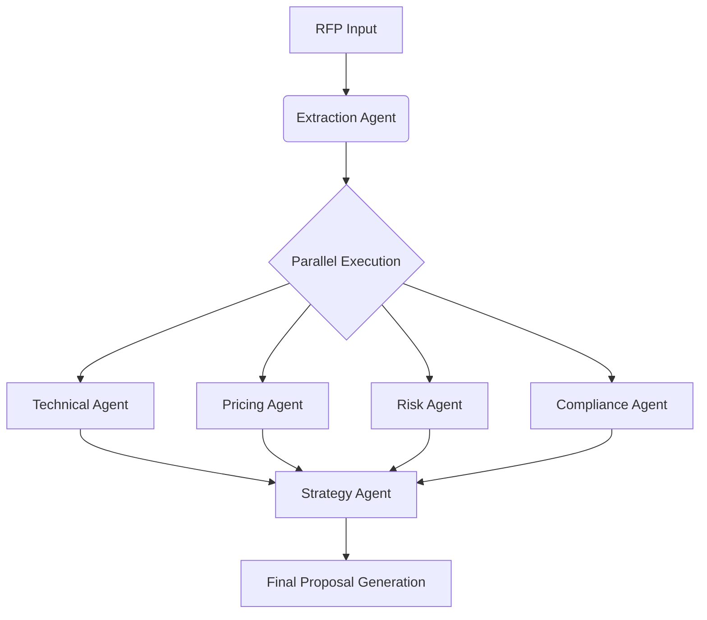

# BidSmart AI — Agentic RFP Response System


**BidSmart AI** is an enterprise-grade, end-to-end Agentic workflow system designed to automate the complex process of responding to Requests for Proposals (RFPs) and Tenders. 

It utilizes **Multi-Agent Orchestration** and **RAG (Retrieval-Augmented Generation)** to autonomously scan for opportunities, match inventory specifications, calculate pricing, assess risk, and generate strategic proposals.

## 🚀 Key Features

### 1. Autonomous Sales Agent 🕵️‍♂️
*   **Web Scanning:** Uses Google Search Grounding to find live tenders and RFPs based on keywords or specific URLs.
*   **Eligibility Check:** Automatically cross-references opportunities against your internal inventory context to determine a "Match Likelihood" score.

### 2. Intelligent Inventory Management (Admin) 📦
*   **AI Data Ingestion:** Upload PDF datasheets, CSVs, or Excel files. The system uses Computer Vision/OCR capabilities of Gemini to structure unstructured product data into queryable SKUs.
*   **Stock Monitoring:** Real-time visualization of stock levels and low-stock alerts.

### 3. Multi-Agent Workstation 🤖
The core engine runs a parallel orchestration pipeline:
*   **Extraction Agent:** Parses complex RFP documents to extract line-item requirements and technical standards.
*   **Technical Agent:** Performs fuzzy vector matching to find the best internal SKU for each requirement, handling unit conversion and specification comparison.
*   **Pricing Agent:** Generates a detailed Bill of Materials (BOM), calculating logistics, contingency, taxes, and multi-currency totals.
*   **Risk & Compliance Agents:** Scans legal terms for liability risks (Liquidated Damages, Warranty) and checks for required certifications (ISO, ASTM).
*   **Strategy Agent:** Synthesizes data to calculate a "Win Probability" score and positions the bid against simulated market competitors.

### 4. Advanced Analytics & Visualization 📊
*   **Graphical Representation:** Includes bar graphs, histograms, pie charts, and heat maps to visualize pipeline health, competitor pricing, and inventory distribution.
*   **Deep Analysis:** Provides real-time visual insights into "Win Probability" trends and market positioning.

### 5. Proposal Generation 📄
*   **PDF Export:** One-click generation of a professional proposal PDF containing the Executive Summary and Commercial Pricing Table.

---

## 🛠️ Tech Stack

*   **Frontend:** React 19, TypeScript, Vite
*   **Styling:** Tailwind CSS
*   **AI & Logic:** Google Gemini API (`gemini-2.5-flash`), `@google/genai` SDK
*   **Visualization:** Recharts
*   **Icons:** Lucide React
*   **Document Handling:** SheetJS (`xlsx`), jsPDF, jsPDF-AutoTable

---

## 📦 Installation & Setup

1.  **Clone the repository**
    ```bash
    git clone https://github.com/yourusername/bidsmart-ai.git
    cd bidsmart-ai
    ```

2.  **Install dependencies**
    *Note: This project uses a modern React setup. Ensure you have Node.js installed.*
    ```bash
    npm install
    ```

3.  **Configure Environment Variables**
    *   This application requires a Google Gemini API Key.
    *   The code looks for `process.env.API_KEY`.
    *   In a Vite environment, create a `.env` file or configure your bundler to inject the key.

4.  **Run the Application**
    ```bash
    npm run dev
    ```

---

## 📖 Usage Guide

### Step 1: Admin Configuration
Navigate to the **Admin Panel**. You must populate the system with data before agents can work.
*   Upload a PDF Product Catalog or an Excel file containing columns like `Model`, `Price`, `Stock`, and `Specs`.
*   Alternatively, click **"Auto-Generate Sample Data"** to populate the system with mock Transformers and Electrical equipment for testing.

### Step 2: Discovery (Sales Console)
Navigate to the **Sales Agent**.
*   Enter a keyword (e.g., "Electrical Infrastructure Tender") or a specific URL.
*   The agent will scan the web, extract opportunities, and rank them based on your current inventory.
*   Click **"Start Response"** on a promising lead.

### Step 3: Execution (Workstation)
Navigate to the **Workstation**.
1.  Click **"Run Pipeline"**.
2.  Watch the visual orchestrator as agents fire in parallel:
    *   *Extraction* -> *Technical Matching* -> *Pricing* -> *Risk/Compliance* -> *Strategy*.
3.  Review the **Win Probability** gauge and **Competitor Analysis** chart.
4.  Check the **BOM & Cost** tab for the financial breakdown.
5.  Click the **Download** icon to generate the final PDF proposal.

---

## 🧠 Agent Architecture

The system uses a centralized **Orchestrator** pattern (`services/orchestrator.ts`).



---

## 🛡️ License

This project is licensed under the MIT License - see the [LICENSE](LICENSE) file for details.
